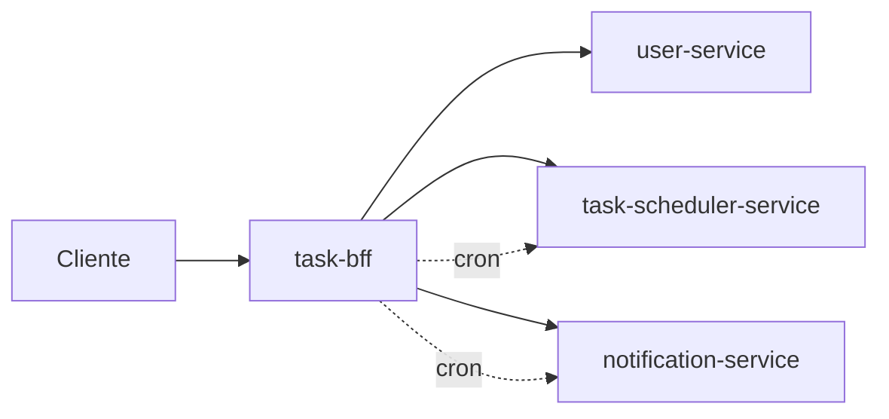

# Task BFF

[](https://openjdk.org/)
[](https://spring.io/projects/spring-boot)
[](https://spring.io/projects/spring-cloud)
[](https://maven.apache.org/)
[](https://spring.io/projects/spring-cloud-openfeign)
[](https://github.com/Javanauta/task-bff/actions/workflows/maven.yml)

Backend-for-Frontend responsavel por orquestrar os fluxos entre usuario, tarefas e notificacao em uma API unica para o cliente.

---

## Sumario

- [Visao Geral](#visao-geral)
- [Papel no Ecossistema](#papel-no-ecossistema)
- [Arquitetura (Visao de Sistema)](#arquitetura-visao-de-sistema)
- [Tecnologias](#tecnologias)
- [Como Executar Localmente](#como-executar-localmente)
- [Configuracao](#configuracao)
- [Agendamento (Cron Job)](#agendamento-cron-job)
- [Autenticacao e Seguranca](#autenticacao-e-seguranca)
- [API](#api)
- [Contratos (DTOs)](#contratos-dtos)
- [Estrutura do Projeto](#estrutura-do-projeto)
- [Testes](#testes)

---

## Visao Geral

O `task-bff` simplifica o consumo do ecossistema de microservicos ao concentrar:

- Fluxos de usuario (cadastro, login, leitura e atualizacao)
- Fluxos de tarefas (criacao, listagem, atualizacao, exclusao e status)
- Fluxo de notificacao por e-mail (via servico externo)
- Job agendado para buscar tarefas proximas e notificar usuarios

---

## Papel no Ecossistema

Este servico atua como camada de orquestracao entre cliente e micros de dominio.

### Integracoes principais

- `user-service` (`usuario.url`) para autenticacao e dados do usuario
- `task-scheduler-service` (`agendador-tarefas.url`) para ciclo de vida das tarefas
- `notification-service` (`notificacao.url`) para disparo de e-mails

### Responsabilidade no sistema

- Reduzir acoplamento do cliente com varios servicos
- Centralizar chamadas e contratos de entrada/saida
- Expor endpoints consistentes para operacoes do dominio

---

## Arquitetura (Visao de Sistema)

Fluxo simplificado:

1. Cliente chama o `task-bff`.
2. O BFF encaminha para o microservico responsavel via OpenFeign.
3. O BFF retorna a resposta consolidada para o cliente.
4. Em paralelo, o job agendado consulta tarefas do periodo e aciona o `notification-service`.



---

## Tecnologias

- Java 17
- Spring Boot 3.5.14
- Spring Cloud OpenFeign (2025.0.2)
- Spring Scheduling
- Spring Web
- Springdoc OpenAPI (Swagger UI)
- Maven
- Lombok

---

## Como Executar Localmente

### Pre-requisitos

- Java 17+
- Maven 3.9+ (ou usar wrapper `mvnw`)
- Git
- `user-service` em execucao
- `task-scheduler-service` em execucao
- `notification-service` em execucao

### 1) Clonar repositorio

```bash
git clone <url-do-repo>
cd task-bff/task-bff
```

### 2) Configurar propriedades

Revise `src/main/resources/application.properties` para os endpoints locais:

- `usuario.url=http://localhost:8080`
- `agendador-tarefas.url=http://localhost:8081`
- `notificacao.url=http://localhost:8082`
- `server.port=8083`

### 3) Subir aplicacao

Linux/macOS:

```bash
./mvnw spring-boot:run
```

Windows (PowerShell):

```powershell
.\mvnw.cmd spring-boot:run
```

---

## Configuracao

Arquivo principal: `src/main/resources/application.properties`

Propriedades mais importantes:

- `usuario.url`: URL base do `user-service`
- `agendador-tarefas.url`: URL base do `task-scheduler-service`
- `notificacao.url`: URL base do `notification-service`
- `server.port`: porta do BFF (padrao `8083`)
- `cron.horario`: expressao cron do job agendado
- `usuario.email` / `usuario.senha`: credenciais de login tecnico para o cron

### Recomendacoes para producao

- Externalizar credenciais e URLs via variaveis de ambiente
- Nao versionar credenciais reais no repositorio
- Ajustar nivel de logs e politicas de observabilidade

---

## Agendamento (Cron Job)

O `CronService` executa com base em `cron.horario` e:

1. Realiza login tecnico no `user-service`
2. Busca tarefas no periodo `agora -> +1 hora`
3. Envia notificacao para cada tarefa encontrada
4. Atualiza status da tarefa para `NOTIFICADO`

Expressao padrao atual:

```properties
cron.horario=0 0/5 * * * ?
```

---

## Autenticacao e Seguranca

- A API utiliza header `Authorization: Bearer <token>`.
- A configuracao de seguranca para documentacao esta em `SecurityConfig`.
- Endpoints de login/cadastro sao encaminhados ao `user-service`.

---

## API

### Base paths

- `/usuario`
- `/tarefas`

### Endpoints de Usuario

- `POST /usuario` -> cadastra usuario
- `POST /usuario/login` -> autentica e retorna token
- `GET /usuario?email={email}` -> busca usuario por email
- `PUT /usuario` -> atualiza dados do usuario
- `DELETE /usuario/{email}` -> remove usuario por email
- `POST /usuario/endereco` -> cadastra endereco
- `PUT /usuario/endereco?id={id}` -> atualiza endereco
- `POST /usuario/telefone` -> cadastra telefone
- `PUT /usuario/telefone?id={id}` -> atualiza telefone

### Endpoints de Tarefas

- `POST /tarefas` -> cria tarefa
- `GET /tarefas` -> lista tarefas por usuario autenticado
- `GET /tarefas/eventos?dataInicial={instant}&dataFinal={instant}` -> lista tarefas por periodo
- `PUT /tarefas?id={id}` -> atualiza tarefa
- `PATCH /tarefas?status={status}&id={id}` -> altera status (`PENDENTE`, `NOTIFICADO`, `CANCELADO`)
- `DELETE /tarefas?id={id}` -> remove tarefa

### Swagger UI

Com a aplicacao em execucao:

- `http://localhost:8083/swagger-ui/index.html`

---

## Contratos (DTOs)

### LoginRequestDTO

```json
{
  "email": "user@email.com",
  "senha": "123456"
}
```

### TarefasDTORequest

```json
{
  "nomeTarefa": "Pagar internet",
  "descricao": "Pagamento mensal do provedor",
  "dataEvento": "2026-05-10T09:00:00Z"
}
```

### TarefasDTOResponse

```json
{
  "id": "680d26f0b2f4f46f8a9f91bc",
  "nomeTarefa": "Pagar internet",
  "descricao": "Pagamento mensal do provedor",
  "dataCriacao": "2026-04-26T20:35:10Z",
  "dataEvento": "2026-05-10T09:00:00Z",
  "emailUsuario": "user@email.com",
  "dataAlteracao": null,
  "status": "PENDENTE"
}
```

> Datas seguem padrao `Instant` (ISO-8601 UTC).

---

## Estrutura do Projeto

```text
task-bff/
├── .github/workflows/maven.yml
└── task-bff/
    ├── pom.xml
    ├── src/main/java/com/azevedo/task_bff
    │   ├── business
    │   ├── controller
    │   ├── insfrastructure
    │   │   ├── client
    │   │   ├── exceptions
    │   │   └── security
    │   └── TaskBffApplication.java
    └── src/main/resources/application.properties
```

---

## Testes

No modulo da aplicacao (`task-bff/task-bff`):

```bash
./mvnw test
```

No Windows:

```powershell
.\mvnw.cmd test
```

---

Se o repositorio no GitHub tiver outro owner/nome, ajuste a URL do badge de CI para o remote correto.
